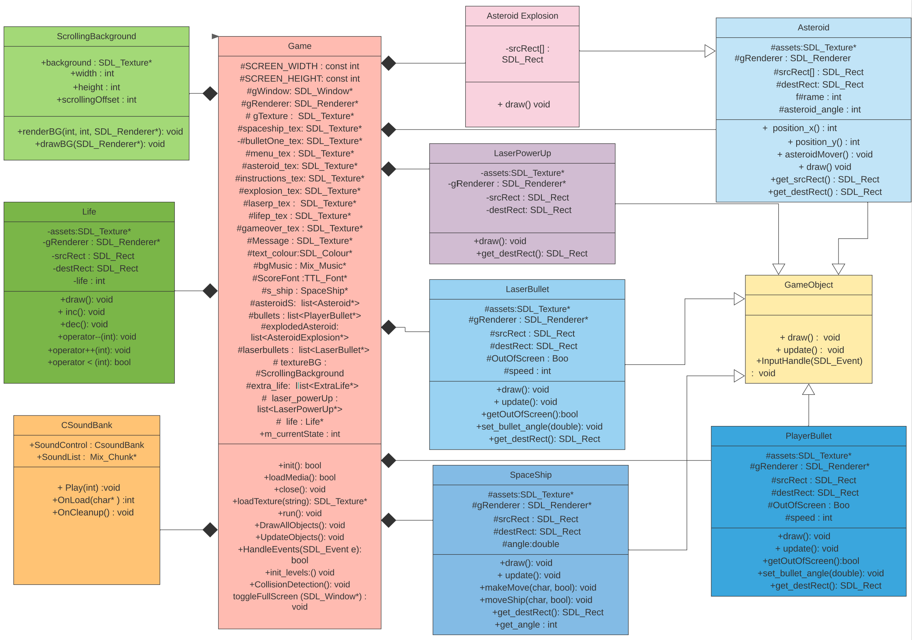

# Asteroids-Game
**Group Project For Object Oriented Programming Course**
Using C++ & SDL
## Description:
Space Raiders is a space-themed shooter arcade game. The player controls a single spaceship in an asteroid field. The object of the game is to shoot and destroy the asteroids, while not colliding with them. The game becomes harder as the number of asteroids increases. The player controls a space-ship that can rotate left and right, and move forward and backward. Once the ship begins moving in a direction, it will continue in that direction for a time without player intervention unless the player applies thrust in a different direction. Each level starts with a few large asteroids drifting in various directions on the screen. The player can collect the laser bullet power that gives it three laser shoots which increase score by a greater amount than a standard bullet. The player space-ship has 3 lives but can gain extra lives by collecting power-ups that appear on the screen randomly. 

 

## Game Rules:
Arrow Keys to determine spaceship movements, space bar to shoot and escape key to pause/unpause.

## UML:

## How to play:
Rub with g++ *.cpp -IC:\mingw_dev_lib\include\SDL2 -LC:\mingw_dev_lib\lib -w -lmingw32 -lSDL2main -lSDL2 -lSDL2_image -lSDL2_mixer -lSDL2_ttf in the python terminal according to where your files are saved.

**Group Member Names:**
Aliza Rafique.
Hafsa Irfan,
Omer,
Sudais Baig
